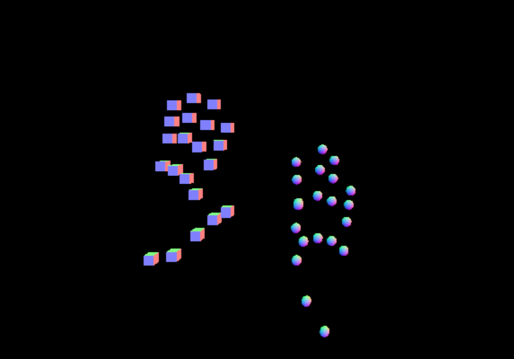

# ThreeJS Hand Control Panel

## Overview

The project is designed to create an interactive 3D visualization of hand landmarks detected in real-time from a video stream, using the MediaPipe Hands model and THREE.js for 3D rendering. It dynamically updates the positions of 3D objects representing hand landmarks based on the detected landmarks, adjusts the camera's position to follow the hand movements, and includes logic to recognize specific hand gestures. The visualization is rendered in a web environment, allowing users to see the hand landmarks in 3D space as they move their hands in front of the camera.

## Getting Started

To run the project, follow these steps:

1. Ensure you have a modern web browser installed.
2. Open the `index.html` file in your web browser.
3. Allow access to your camera when prompted.

## Project Structure

- `index.html`: The main HTML file that loads the project.
- `main.js`: The JavaScript file that contains the logic for the 3D visualization, including the setup of the THREE.js scene, the MediaPipe Hands model, and the logic for updating the 3D objects based on the detected hand landmarks.

## Screenshots  

Here are some screenshots of the **GoFlix** app showcasing its key features and design:  

  

## Dependencies

- **THREE.js**: A JavaScript library used for creating and displaying animated 3D computer graphics in a web browser.
- **MediaPipe Hands**: A machine learning model for detecting hand landmarks in real-time from a video stream.

## How It Works

1. The project uses the MediaPipe Hands model to detect hand landmarks in real-time from the video stream captured by the user's camera.
2. The detected hand landmarks are then used to update the positions of 3D objects in the THREE.js scene, creating a visual representation of the hand landmarks in 3D space.
3. The camera's position is dynamically adjusted to follow the hand movements, providing a more immersive experience.
4. Specific hand gestures are recognized, and the visualization responds accordingly, such as adding or removing objects from the scene.

## Contributing

Contributions are welcome! Please feel free to submit pull requests or open issues if you have any suggestions or improvements.